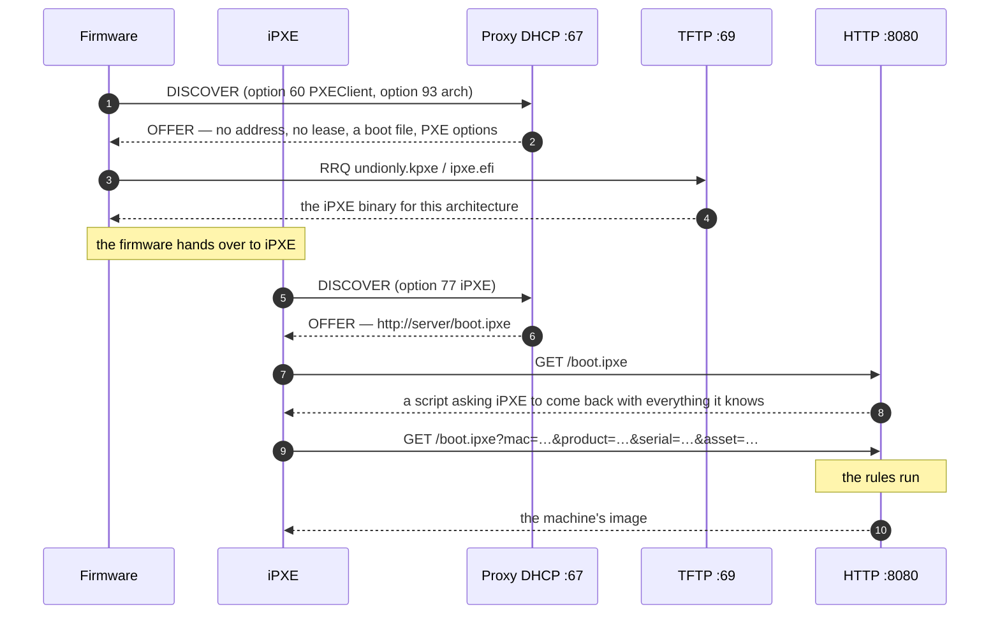
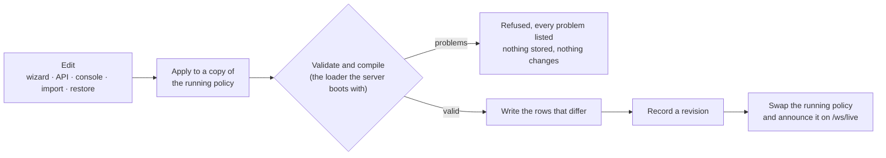
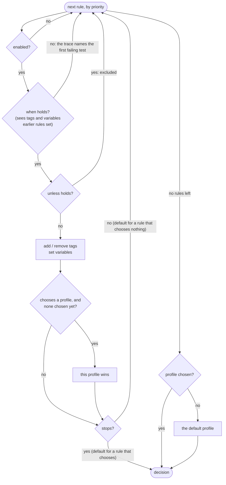

# kindling

A network boot server that can explain itself.

PXE is three protocols in a trenchcoat, and every one of them fails silently.
A machine that gets the wrong boot file does not report an error — it falls
through to the next device in its boot order and comes up on the disk it was
supposed to be replacing. This server is built around that: the policy that
decides which machine gets which image is built in a web UI you can read, it
is checked against your real machines before it is saved, and every decision
it makes comes with the reason.

```console
$ pxe test --mac=18:66:da:11:22:33 --product="OptiPlex 7090"
18:66:da:11:22:33 — Dell (OptiPlex 7090), x64-uefi
  stage ipxe   device class physical   ipxe true   known false

Decision
  profile  ubuntu-2404
  from     rule
  because  rule `image-new-machines` chose `ubuntu-2404`

Every rule, in order
+--------------------------------+-----------------------------------+
| RULE                           | OUTCOME                           |
+--------------------------------+-----------------------------------+
| never-touch-network-gear       | no match (device_class: device_class is one of network) |
| held-machines-boot-their-disks | no match (tag: tag include any of hold)                  |
| tag-virtual-machines           | no match (device_class: device_class is one of virtual) |
| tag-by-subnet                  | no match (network: network is in 10.20.0.0/16)          |
| image-new-machines             | matched → ubuntu-2404, stops here |
+--------------------------------+-----------------------------------+
```

`no match (arch)` rather than `no match` is most of the point. Built on
[Rainier](https://github.com/safewords/rainier-framework).

## What it does

- **Proxy DHCP** (ports 67 and 4011) that hands out **no addresses**. It
  answers the boot half of the conversation beside whatever already does DHCP
  on your network — a router, a Windows server, somebody's `dnsmasq`. Standing
  up a second address-assigning DHCP server is how a network stops working.
- **TFTP** (port 69), read-only, with RFC 7440 windowing and block-size
  negotiation — the difference between a 300MB image taking two minutes and
  taking twenty.
- **HTTP**: iPXE scripts generated per machine, the same boot directory served
  over both protocols, a JSON API and a small admin interface.
- **A rule engine** whose conditions are trees — `all`, `any` and `not` groups
  of tests over some two dozen facts: hardware address, OUI, vendor, device
  class, architecture, firmware, DHCP vendor and user class, hostname, UUID,
  network, SMBIOS manufacturer / product / serial / asset tag, tags, boot
  count, time of day, day of week, whether this server has seen the machine
  before, and variables earlier rules set. Globs, regular expressions, lists,
  subnets, ranges. Rules can boot a profile, add and remove tags, and set
  variables that later rules and profile templates read.
- **The policy lives in the database**, with every change kept as a revision
  and any revision one click from being restored.
- **An inventory** that records machines as they appear, never by declaration,
  with per-machine pins and one-shot boots for when the rules have it wrong.
- **An admin interface** (Vue 3 + Tailwind, built locally, no CDN) with a
  device pane, a step-by-step **rule wizard** and profile wizard that show which
  of your machines a change would affect before you save it, and a
  configuration editor that refuses to save a `.env` that would not start.

## Quick start

```sh
cp .env.example .env    # the policy itself is seeded into the database on first start

# the stage-one loaders. Note the EFI builds live under an architecture
# directory; only the BIOS one is at the root.
curl -o tftproot/undionly.kpxe https://boot.ipxe.org/undionly.kpxe
curl -o tftproot/ipxe.efi      https://boot.ipxe.org/x86_64-efi/ipxe.efi
curl -o tftproot/ipxe32.efi    https://boot.ipxe.org/i386-efi/ipxe.efi
curl -o tftproot/ipxe-arm64.efi https://boot.ipxe.org/arm64-efi/ipxe.efi

sudo -E cargo run -- pxe:serve     # 67, 69 and 4011 are privileged ports
```

Then <http://localhost:8080>, and the **Policy** screen. On Windows, an elevated prompt; or
`pxe:serve --no-dhcp --no-tftp` to run only the HTTP half while you write
policy.

The admin interface ships pre-built. To work on it:

```sh
npm install
npm run build          # writes public/build, which the server serves
npm run dev            # or: hot reload, while `pxe:serve` keeps running
```

`npm run dev` writes `public/hot`; the shell template notices and points at the
dev server instead of the bundle. Stop it and the bundle comes back. A clone
that has never run npm still serves — the page arrives unstyled rather than
broken.

```sh
cargo run -- pxe:doctor         # everything that would silently not work
cargo run -- pxe:test --mac=…   # what would this machine boot, and why
cargo run -- pxe:hosts          # the inventory
cargo run -- pxe:log            # what has actually happened
cargo run -- pxe:pin --mac=… --profile=ubuntu-2404 --once
cargo run -- pxe:rules --check=policy.toml  # validate a file before --import; what a deploy runs
cargo run -- pxe:rules --history            # every policy change; --restore=ID rolls back
cargo run -- pxe:ipxe --build   # compile this project's own iPXE (see below)
```

`pxe:doctor` is the one to run first. Network boot fails quietly — a machine
offered a file that is not there gets a TFTP error it does not display and
falls through to its disk — so it asks the questions a machine would and
answers them against the disk:

```
  [FAIL] loader for bios is missing: undionly.kpxe
         `tftproot/undionly.kpxe` does not exist. A machine of bios would be
         offered it, fail to fetch it, and fall through to its next boot
         device silently.
  [warn] profile `ubuntu-2404` points at a file that is not there
         `{{boot}}/images/ubuntu-24.04/vmlinuz` → `tftproot/images/…/vmlinuz`
```

It exits non-zero on anything fatal, so it belongs in a deploy pipeline.
`--ports` also tries to bind 67, 69 and 4011.

## How a boot goes



Two things about that shape. The reply to iPXE is a **script, not iPXE again**
— without that check a machine chainloads iPXE from iPXE for ever. And the
second `/boot.ipxe` request is why rules can match on a product name or an
asset tag: no DHCP packet carries those, but iPXE has read the SMBIOS tables by
then.

### Not looping

Handing iPXE back to iPXE is the classic PXE failure, and it is silent: every
individual exchange looks perfectly correct. Three things stop it here.

1. **Option 77.** iPXE sets the user class to `iPXE`, and a machine that says
   so gets the script.
2. **Option 175.** iPXE's own encapsulated options, which nothing else sends.
   A build configured without `DHCP_CLIENT_USER_CLASS`, or a relay that strips
   option 77, is still recognised.
3. **The loop breaker.** If a machine has been offered the same loader across
   several *whole DHCP transactions* inside ninety seconds without reaching a
   script, it is running that loader and coming back — so it is handed the
   script instead, and the recovery is logged and written to the boot log
   rather than silently papered over.

The third counts transactions rather than requests on purpose: firmware
retransmitting one `DISCOVER` reuses its transaction id, so a lossy network is
never mistaken for a loop. Tune it with `PXE_LOOP_THRESHOLD` and
`PXE_LOOP_WINDOW_SECS`; below 2 turns it off.

The structural fix is better than all three: an iPXE that never asks DHCP
for a filename in the first place. That is the next section.

## Our own iPXE

`ipxe/` builds upstream iPXE — pinned to one commit, fetched at build time,
never vendored — with this project's configuration and a script compiled in,
for every architecture above: `undionly.kpxe`, `ipxe.efi` and `snponly.efi`
for x86_64 and i386 EFI, and arm64 EFI, cross-compiled.

```sh
cargo run -- pxe:ipxe --build       # all of them, with PXE_HTTP_BASE compiled in
cargo run -- pxe:ipxe               # what is built, and what is in service
cargo run -- pxe:ipxe --install     # put them in place, keeping a backup
```

The compiled-in script is the point. It does DHCP on each interface in turn,
goes to the server it was built for — or, built with `--embed-base=none`, to
the proxy's or router's `next-server` — and asks for `/boot.ipxe` with every
fact the reflector would have asked for, saving a round trip. It never
follows a DHCP boot filename that names a loader, so a router whose "Network
Boot" option says `ipxe.efi` cannot send it round in a circle; that is the
failure `tftproot/autoexec.ipxe` currently papers over. If nothing answers it
says so on screen, counts down, and hands back to the firmware — or, on a
keypress, to the iPXE shell, which has `ping`, `nslookup` and HTTPS.

It identifies itself as `iPXE-kindling` in option 77: still `iPXE` to every
check that looks for iPXE, and told apart in `pxe:test` and by rules that
want to. `pxe:doctor` reports each build and warns when the server compiled
into one is not this one.

The compile runs in a container (Docker or Podman), so a Windows laptop and
CI use the same toolchain; `ipxe/build.sh` and `ipxe/build.ps1` do the same
without the Rust app. Building never touches the loaders in service — output
goes to `tftproot/ipxe-build/`, where one machine can try it before
`--install` gives it to all of them. The details, and the reasons, are in
[`ipxe/README.md`](ipxe/README.md).

## The admin interface

Five screens, all of them a read of the API — nothing in the browser can do
anything `curl` cannot.

**Every screen is live.** Boot events, new machines, boot counts, pins, tags
and policy reloads are pushed over a WebSocket at `/ws/live` on the HTTP port
— no second port — the moment they are written, so a rack coming up can be
watched as it happens. Like the rest of the read API it needs no token, and
it carries nothing the read API would not show. The dot in the header says
whether the feed is connected. While it is not, the screens go back to
fetching every ten seconds.

**Machines** is the device pane: search across address, hostname, vendor,
product and serial; filter by tag, vendor or architecture, counted across the
whole inventory rather than the page you happen to be holding; select any
number and pin, one-shot, tag, untag or forget them in one call. A machine's
own page shows what it told us, what it would boot *right now* with the rule
trace behind that answer, and everything that has happened to it.

**Policy** is where the rules, profiles, boot loaders and settings are
edited. Rules are listed in evaluation order, each with its conditions in
words, and can be toggled, reordered, duplicated or edited.

A rule is built in the **rule wizard**: pick a starting point (built-in, or one
you saved), build *which machines* as a tree of condition boxes, choose *what
happens*, add exceptions and time windows, place it among the other rules, and
then — before the save button — see **which machines in the inventory it would
fire for and which of them would boot something different**. Every step is
checked live against the same validator the server loads with, so a rule that
would not load cannot be saved. Nothing in the wizard names a fact: the
editor is drawn from `GET /api/policy/schema`, so a fact added to the server
appears in the UI without a frontend change.

The **profile wizard** is a form per kind — kernel, script, menu, local disk,
no answer — with the iPXE it would produce rendered beside it as you type.
Renaming a profile carries every rule, menu entry and default with it.

**History** lists every change, whole, with who made it; restoring one is
itself a change, so a rollback can be rolled back. **Import / export** moves
the policy as JSON or TOML, and an import is checked, and its effect on known
machines shown, before it replaces anything.

**Configuration** edits `.env` the same way, in place, with a catalogue that
says what each of the 24 settings is for and what goes wrong when it is wrong.
A proposed file is run through the *same* `configure` the server boots with
before it is written, so you cannot save a `.env` that will not start. It is
honest about the restart: configuration is read once, at startup, and the
screen says so rather than implying otherwise.

Everything that changes what a machine boots — including both editors — is
behind the API token.

## The policy

The policy lives in the database: one table each for rules, profiles, boot
loaders and settings, and a `policy_revisions` table holding every version
whole. Every change — from the wizard, the API, the console, an import or a
rollback — goes through one path:



Edits are serialised, and one made against an older revision (the
`x-policy-revision` header, which the web UI always sends) is refused with a
409 rather than silently overwriting a change its author never saw.

**Upgrading from the file-based release:** on the first start against an
empty database, the TOML file at `PXE_RULES_PATH` (default `pxe-rules.toml`)
is imported and becomes revision 1; after that it is never read. Without one,
the starter policy in
[`src/database/seeds/starter-policy.toml`](src/database/seeds/starter-policy.toml)
is seeded — the same text `pxe:rules --example` prints.

### Rules

A rule is a condition and some actions:

```json
{
  "name": "r640s-become-storage-nodes",
  "priority": 250,
  "when": { "all": [
    { "fact": "product", "op": "glob", "value": ["PowerEdge R64*"] },
    { "any": [
      { "fact": "known", "op": "is", "value": false },
      { "fact": "tag", "op": "has_any", "value": ["reimage"] }
    ] },
    { "not": { "fact": "device_class", "op": "in", "value": ["network"] } }
  ] },
  "unless": { "fact": "tag", "op": "has_any", "value": ["hold"] },
  "profile": "arch-r630",
  "tag": ["ceph"],
  "remove_tags": ["reimage"],
  "set": { "role": "storage" }
}
```

Rules run in priority order, highest first, ties in the order they were added.
How one machine's evaluation goes:



Because a rule's tags and variables are visible to every rule after it, one
rule can *classify* a machine (`set = { role = "storage" }`) and a later one
act on the class (`var.role equals storage`) — and the chosen profile can use
it too, as `{{ var.role }}` on a kernel command line.

`{{ … }}` is expanded by this server; `${ … }` is expanded by iPXE on the
machine. They deliberately do not collide, so a hand-written script can use
both.

### What a rule can ask about

| fact | | operators |
|---|---|---|
| `mac`, `vendor`, `hostname`, `uuid` | the address, the OUI's vendor, DHCP options 12 and 97 | glob, equals, in, contains, starts/ends with, regex, exists, missing — and their negations |
| `oui` | the IEEE prefix, however it is written | in, not in |
| `device_class` | `physical`, `virtual`, `sbc`, `network`, `unknown` | in, not in, equals |
| `arch` | a label (`x64-uefi`), a family (`arm64`), a firmware (`uefi`) or a number | in, not in |
| `vendor_class`, `user_class` | DHCP options 60 and 77 | as text |
| `manufacturer`, `product`, `serial`, `asset`, `platform` | SMBIOS and firmware, via iPXE | as text |
| `stage`, `ipxe`, `ipxe_build`, `http_boot` | which half of the boot is asking, and how | in / is |
| `network`, `client_ip`, `relay_ip` | the relay's address or the client's | in subnet, not in subnet, equals |
| `tag` | labels on the machine, plus those earlier rules added | has any / all / none, empty |
| `known` | whether it has ever been *served a boot script* here | is |
| `boot_count` | how many times it has | =, ≠, <, ≤, >, ≥, between |
| `time`, `weekday` | when, in UTC shifted by the policy's offset | between / in |
| `var` | a variable an earlier rule set | as text |

Text comparisons are case-insensitive. A misspelt fact, an operator a fact
does not take, a regex that does not compile or a subnet that does not parse
is a **refusal**, reported with every other problem at once — never a
condition that quietly matches everything.

## Three ways to override the rules

In precedence order:

1. **One-shot** — `pxe:pin --mac=… --profile=… --once`. Spent when the machine
   is actually served its script, not when it is offered a boot file, so a
   machine that is offered one and never comes back still has its one-shot
   waiting.
2. **Pin** — `pxe:pin --mac=… --profile=…`. Until somebody clears it.
3. **Tags** — `pxe:tag --mac=… --add=hold`, matched by a `tag has any hold`
   condition. How you take one machine out of a policy without naming its
   address in a rule.

An override naming a profile that no longer exists falls through to the rules
with the reason saying so, rather than leaving the machine with nothing to
boot.

## The API

Reads are open. Everything that changes what a machine will boot needs
`PXE_API_TOKEN`, and **when no token is configured those endpoints are closed,
not open** — this server decides what a fleet executes at power-on, and the
convenient default is a remote-code-execution primitive on a boot VLAN.

```
GET    /api/health                  what is running, and at which policy revision
GET    /api/hosts                   ?search= ?tag= ?page=
GET    /api/hosts/{mac}             the machine and its history
GET    /api/events                  the boot log
POST   /api/rules/test              what would this machine boot, and why

GET    /api/policy                  the running policy, rule by rule
GET    /api/policy/schema           facts, operators, profile kinds — what the editors draw
POST   /api/policy/validate         would this rule / document load?   (writes nothing)
POST   /api/policy/preview          which known machines would it change? (writes nothing)
POST   /api/policy/profiles/render  the iPXE an unsaved profile produces
GET    /api/policy/export           ?format=json|toml
GET    /api/policy/revisions[/{id}] the history
GET    /api/policy/templates        the wizard's saved starting points

PUT    /api/policy                  replace it all: {"document"} or {"text"} ← token
POST   /api/policy/rules            add a rule                            ← token
PUT    /api/policy/rules/{name}     replace (and maybe rename) a rule     ← token
PATCH  /api/policy/rules/{name}     change some fields; null clears       ← token
DELETE /api/policy/rules/{name}                                           ← token
POST   /api/policy/rules/{name}/enabled   {"enabled": false}              ← token
POST   /api/policy/rules/reorder    {"order": [names…]}                   ← token
PUT    /api/policy/profiles/{name}  a profile, optional "rename_to"       ← token
DELETE /api/policy/profiles/{name}  refused while anything points at it   ← token
PUT    /api/policy/settings         default profile, timezone offset      ← token
PUT    /api/policy/bootloaders/{arch}  {"file": …} or null                ← token
POST   /api/policy/revisions/{id}/restore                                 ← token
POST   /api/policy/templates   DELETE /api/policy/templates/{id}          ← token
POST   /api/rules/reload            re-read the stored policy             ← token

POST   /api/hosts/{mac}/pin         {"profile": "…"}          ← token
DELETE /api/hosts/{mac}/pin                                   ← token
POST   /api/hosts/{mac}/once        {"profile": "…"}          ← token
DELETE /api/hosts/{mac}/once                                  ← token
POST   /api/hosts/{mac}/tags        {"add": […], "remove": […]}  ← token
DELETE /api/hosts/{mac}             forget it entirely        ← token
```

A change that would not load changes nothing and reports every problem at
once, so a mistake saved mid-rollout cannot leave a rack with no policy.

## Decisions worth knowing about

- **It hands out no IP addresses, ever.** Proxy DHCP answers boot questions
  beside your existing DHCP server rather than replacing it. `yiaddr` is always
  `0.0.0.0` and there is no lease, no netmask and no gateway in any reply.
- **Policy is data, with its history.** It used to be a file in version
  control, for review and rollback. Those survive the move: every change is a
  revision holding the whole policy, attributed and restorable, and export
  gives a reviewable file whenever one is wanted. What the move adds is a
  policy that can be built by somebody who has never seen its syntax, checked
  against the real inventory before it is saved.
- **A machine boots even when the database does not.** A failed inventory query
  logs, degrades to "no overrides, never seen before", and the rack comes up.
  Reporting is not the decision path.
- **`known` means "has this machine ever been given something to boot".** Not
  "is there a row for it", which is the obvious definition and is wrong: one
  boot is three or four requests, the row is created by the first, and the
  script — the only request that picks an image — is the last. Under the
  obvious definition `known = false` fires at the DHCP stage, where nothing is
  chosen, and never at the stage where something is. It is the boot counter,
  which only moves when a script is actually served.
- **TFTP is read-only and cannot be made writable.** TFTP has no
  authentication of any kind; a writable TFTP server on a boot network is a way
  for anything on that network to replace the loader every machine is about to
  execute.
- **`kind = "ignore"` is a real answer.** On a network with another boot server
  on it, saying nothing is the correct thing to say.
- **Architecture and loop bugs are server-side, so they are fixed server-side.**
  Handing a machine the wrong binary is option 93 handling, and chainloading in
  a circle is failing to recognise iPXE. Replacing iPXE with something
  home-grown would move neither — and on BIOS it would mean writing a TCP/IP
  stack for real mode. `pxe:doctor` and the loop breaker attack them where they
  actually live.
- **There is no rate limiter.** A per-process counter states a limit multiplied
  by however many replicas are running, which is a number nobody can act on.
  The token guards the write surface; a deployment that needs a real limit
  wants one in the proxy in front.

## Layout

```
ipxe/             this project's iPXE: pinned upstream, config, embedded script
resources/
  js/             the admin interface — Vue 3, one page per screen
  css/app.css     Tailwind 4, no CDN: boot networks are often offline
src/
  pxe/            the domain — packets, rules, profiles, policy
    dhcp/         proxy responder, packet codec, PXE vendor options
    tftp/         read-only server, packet codec
    condition.rs  condition trees: facts, operators, compilation
    rules.rs      the policy document, validation and evaluation
    policy.rs     facts + rules + overrides → a decision
  app/            where that meets storage, config and the network
    models/       the inventory, the boot log and the policy tables
    services/     the policy store, the env editor, the loop breaker
    http/         controllers, the token guard, the kernel
    console/      pxe:serve, pxe:rules, pxe:test, pxe:hosts, pxe:pin, pxe:ipxe, …
  config/         one module per concern, read from .env
  database/       migrations, and the starter policy seed
```

Everything in `pxe/` is a pure function of its inputs and is tested without a
database, a socket or a framework. That is why the rule engine can be asked
hypothetical questions.

## Tests

```sh
cargo test
```

299 of them: the packet codecs against malformed input, the rule engine against
its own trace, and — over real sockets on ephemeral ports — a TFTP transfer
whose length is an exact multiple of the block size (the classic hang), path
traversal in four spellings, RFC 7440 windowing, and a proxy DHCP exchange from
`DISCOVER` to boot file.

## Licence

MIT OR Apache-2.0.
